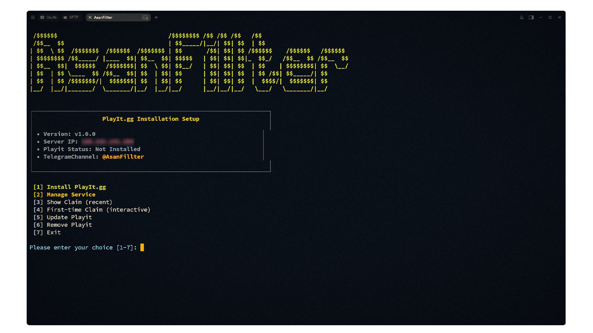

<div align="center">
  <h1>Playit Launcher</h1>
  
  <p style="margin: 0;"><strong>Professional tunneling service installer and manager for Playit.gg</strong></p>
  <div style="display:flex; gap:10px; justify-content:center; margin: 12px 0 14px;">
    
    
    
    
  </div>
</div>

<div align="center" style="margin-top:8px;">
</div>

## Features

- **One-Click Installation**: Automated setup with official Playit repositories
- **Service Management**: Start, stop, restart, and monitor Playit service
- **Claim URL Generation**: Automatic detection and display of claim links
- **Status Monitoring**: Real-time service status and log viewing
- **Auto Updates**: Easy update mechanism for latest Playit versions
- **Systemd Integration**: Full systemd service management

## Requirements

- **Linux**: Ubuntu/Debian with `apt` package manager
- **Permissions**: Root/sudo access for installation and service management

## PlayitLauncher Installation

```bash
sudo apt update -y && sudo apt install git -y
git clone https://github.com/AsanFillter/Playit-Launcher.git
cd Playit-Launcher
chmod +x PlayitLauncher.sh
./PlayitLauncher.sh
```

## Project Structure

```
Playit-Launcher/
├── PlayitLauncher.sh    # Main installation and management script
├── README.md           # This file
└── LICENSE             # MIT License
```

## What is Playit?

[Playit.gg](https://playit.gg) is a free tunneling service that allows you to expose your local applications to the internet. It's perfect for:

- **Web Development**: Share your local development server
- **Gaming**: Host game servers accessible from anywhere
- **Mobile Testing**: Test mobile apps with local backends
- **API Development**: Share your local APIs with team members
- **Home Automation**: Access home services remotely


## Service Management

Once installed, you can manage Playit using systemctl:

```bash
# Check status
sudo systemctl status playit

# Start service
sudo systemctl start playit

# Stop service
sudo systemctl stop playit

# Enable auto-start
sudo systemctl enable playit

# View logs
sudo journalctl -u playit -f
```

## Support

- **Telegram Channel**: [@AsanFillter](https://t.me/AsanFillter)
- **Telegram Group**: [@AsanFillter_Group](https://t.me/asanfillter_group)

⭐ If you like this project, don't forget to star the repo:

[](https://starchart.cc/AsanFillter/Playit-Launcher)